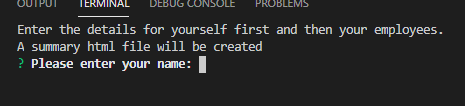
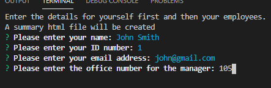
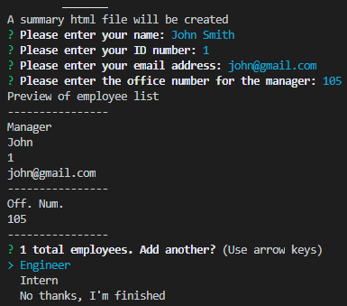
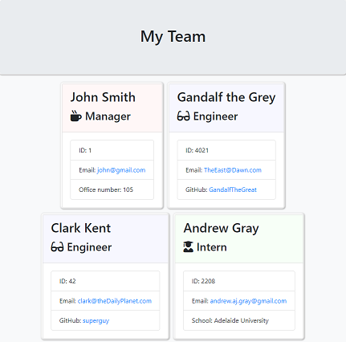

# Team Profile Builder
CLI program to create a HTML file with team member details.  

## Table of Contents
1. [Installation](#Installation)
2. [Usage](#Usage)
3. [License](#License)
4. [Contribution](#Contribution)
5. [Questions](#Questions)
## Installation
You can Fork and clone this repository to your local machine.  
This program requires **Node.js**, **Inquirer** and **Jest** for testing.  
The included package.json means you can type `npm install` from the command line to install Inquirer.
## Usage
`node app` will run the program.  
Then simply follow the prompts to create your team.html file.  
The prompts will ask for:
* Employee name
* Employee ID
* Employee email
* Office Number for Mangers
* School for Interns
* Github username for Engineers

The first Employee entered is the team manager and as you complete each employee's details there will be a prompt to add another employee or to create the html file.

## License
This project uses a MIT license.
## Contributing
This was a solo project by Andrew Gray.  
The tests, html renderer and base html templates were provided by the bootcamp.  
This project is not open to contributions at this time.
## Tests
With **Jest** installed, type `npm run test` in the app directory. This will run the tests on the Employee, Intern, Manager and Engineer class files.
## Questions
You can find my github account at
[Andrew836-dev](https://github.com/Andrew836-dev)  
